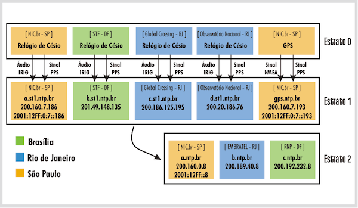

# Fundamentos de Redes de Computadores - Trabalho 01 (SNTP)

### Professor
- Tiago Alves

### Alunos
- Arthur Barbosa Diniz  15/0118457
- Vitor Falcao H. Costa 15/0148623

### Dependência
GCC

### Compilar
```bash
gcc socket.c -o socket
```

### Rodar
```bash
./socket
```

### Uso
Ao rodar o projeto o usuário deverá informar o IP ou nome do serviço.
#### Exemplo:
```bash
$ ./socket
Type your hostname: a.ntp.br
--------------------------------------------
- Set the 48-byte string
- Setup our Socket and Server Data Structure
- Convert hostname: a.ntp.br to IP
- Send our Message to the Server
- Retrieve packet back from server
--------------------------------------------
Time: Wed Apr 17 20:11:13 2019
```

### Informações de Desenvolvimento

- Sistemas operacionais usado para desenvolvimento:
    - Arch Linux
    - MacOS

- Versões
    - gcc (GCC) 8.2.1 20181127


## A Estrutura do NTP.br

Os servidores públicos estrato 2 do NTP.br são:
```
a.ntp.br
b.ntp.br
c.ntp.br
```

Cada um desses endereços representa um servidor duplo: duas lâminas numa blade, cada uma delas com duas placas de rede conectadas a estruturas de rede distintas (routers e switches diferentes). Ou seja, há redundância de hardware e de conectividade, com balanceamento automático. Cada um deles está em um datacenter diferente, com ótima conexão à Internet.

Eles são alimentados por servidores primários (estrato 1), também acessíveis publicamente:
```
a.st1.ntp.br
b.st1.ntp.br
c.st1.ntp.br
d.st1.ntp.br
```
Esses, por sua vez, são sincronizados com relógios atômicos, que são de responsabilidade do Observatório Nacional.

Existe também um servidor que utilizamos para monitoração do sistema. É um servidor ntp estrato 1, sincronizado com o Sistema de Posicionamento Global (GPS). Ele também pode ser usado:
```
gps.ntp.br
```
O servidor de monitoração consulta todos os servidores estrato 1 e estrato 2 do NTP.br e através de seus logs são gerados gráficos que podem ser visualizados nesta página.

A figura a seguir representa a estrutura do NTP.br:


